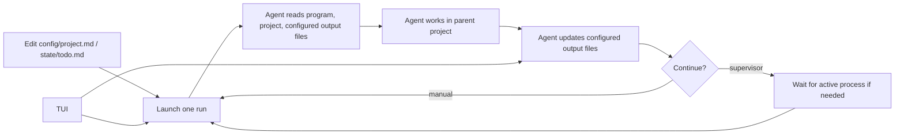

# my-autoresearch

`my-autoresearch` is a reusable autoresearch harness meant to live inside an
existing project as a subdirectory.

It is inspired by [karpathy's autoresearch](https://github.com/karpathy/autoresearch)
and wraps the same iterative idea with explicit context files, launch settings,
session handoff, and lightweight process supervision.

Typical layout:

```text
host-project/
  my-autoresearch/
    config/
      autoresearch.config.json
      program.md
      project.md
    state/
      run_state.json
      handoff.md
      todo.md
      plan.md
      next_run.json
    results/
      results.tsv
      experiment_journal.md
    autoresearch/
      logs/
      sessions/
      tmp/
      inbox.jsonl
    scripts/
    templates/
```

The harness code and stable project contract stay under `config/`.
Runtime agent cycle state files live in `state/`, experiment outputs in
`results/`, and intermediate logs and temporary files under `autoresearch/`.

## Contents

- [Get Started](#get-started)
- [Files To Edit](#files-to-edit)
- [Init Templates](#init-templates)
- [State Files](#state-files)
- [Supervisor And TUI](#supervisor-and-tui)
- [Configuration](#configuration)
- [Next Run](#next-run)
- [Run Logic](#run-logic)

## Get Started

From an existing project root:

```bash
git clone <repo-url>
cd my-autoresearch
```

Edit the project-specific files yourself, or ask an agent to fill them in:

- `config/project.md`: objective, metric, commands, protected files.
- `state/todo.md`: first concrete task, if needed.
- `config/autoresearch.config.json`: paths or model defaults, if the
  defaults are not enough.

```bash
python3 my-autoresearch/scripts/init_harness.py
python3 my-autoresearch/scripts/autoresearch_next.py --dry-run
python3 my-autoresearch/scripts/autoresearch_next.py
```

Use `scripts/autoresearch_supervisor.py` instead when you want the loop to keep
starting new sessions after the previous one finishes.

## Files To Edit

For a new project, usually edit only these files:

- `config/project.md`: project objective, metric, commands, protected files, and
  output paths.
- `state/todo.md`: the first concrete task, if the default task is not enough.
- `config/autoresearch.config.json`: workspace path, file names, or default
  model settings.
- `opencode.json`: permission rules, if the project has files that need hard
  protection.

Do not normally edit `config/program.md` directly. Edit `templates/program.md.in`
for workflow text that should apply to future generated copies, or edit
`config/autoresearch.config.json` for install-time options.

## Init Templates

`config/program.md` is generated from `templates/program.md.in` by
`scripts/init_harness.py`. The template uses simple `{{NAME}}` placeholders and
the script performs one-time text replacement during init/install. The generated
`program.md` is ordinary Markdown; runtime agents should not see unresolved
template placeholders.

Run this after changing install-time options in `config/autoresearch.config.json`:

```bash
python3 my-autoresearch/scripts/init_harness.py
```

Use check mode in CI or before committing template changes:

```bash
python3 my-autoresearch/scripts/init_harness.py --check
```

Keep frequently changing project details in `config/project.md`. Keep
machine-readable runtime settings in `config/autoresearch.config.json`.

## State Files

- `config/program.md`: generic autoresearch process and operating rules.
- `config/project.md`: project-specific contract.
- `state/next_run.json`: model, reasoning effort, prompt, and task for the next
  agent session.
- `state/run_state.json`: machine-readable current state.
- `state/handoff.md`: short human-readable handoff.
- `state/plan.md`: medium-term strategy.
- `state/todo.md`: short-term task queue.
- `results/experiment_journal.md`: detailed attempt history.
- `results/results.tsv`: compact result table.
- `autoresearch/logs/`: project command logs.
- `autoresearch/sessions/`: `opencode run` session logs.
- `autoresearch/tmp/`: disposable scratch files.

## Supervisor And TUI

The supervisor and TUI communicate through the configured output files. The TUI
is not the process manager and does not need to stay open.

Run the supervisor in a persistent shell, `tmux`, or the background:

```bash
python3 my-autoresearch/scripts/autoresearch_supervisor.py
```

Open the TUI only when you want to inspect status, tail recent logs, or queue a
control event:

```bash
python3 my-autoresearch/scripts/autoresearch_tui.py
```

TUI keys:

- `s`: queue a suggestion for the next run.
- `S`: queue a suggestion and interrupt the recorded session or process.
- `f`: queue a finish request for the next run.
- `F`: queue a finish request and interrupt the recorded session or process.
- `q`: quit the TUI.

Closing the TUI does not stop the supervisor or any recorded project process.
Force actions work by reading pids from `run_state.json` and sending a signal.

## Configuration

`config/autoresearch.config.json` controls paths and defaults:

```json
{
  "workspace_dir": "..",
  "state_dir": ".",
  "output_dir": ".",
  "agent": {
    "command": "opencode",
    "default_model": "deepseekv4flash",
    "default_reasoning_effort": "xhigh",
    "available_models": {
      "deepseekv4pro": "deepseek/deepseek-v4-pro",
      "deepseekv4flash": "deepseek/deepseek-v4-flash"
    },
    "available_efforts": ["medium", "high", "xhigh", "max"]
  },
  "experiment": {
    "time_budget_minutes": 5,
    "timeout_minutes": 10,
    "branch_mode": "direction",
    "branch_cleanup": "suggest"
  },
  "termination": {
    "mode": "manual",
    "results_file": "results",
    "metric_column": "primary_metric",
    "target": null,
    "scale": "unit",
    "eligible_statuses": ["keep", "continue"],
    "finalize_with_agent": true
  },
  "supervisor": {
    "opencode_timeout_seconds": 3600,
    "active_process_stale_seconds": 7200,
    "kill_grace_seconds": 15
  },
  "files": {
    "program": "config/program.md",
    "project": "config/project.md",
    "state": "state/run_state.json",
    "todo": "state/todo.md",
    "plan": "state/plan.md",
    "handoff": "state/handoff.md",
    "journal": "results/experiment_journal.md",
    "results": "results/results.tsv",
    "next_run": "state/next_run.json",
    "inbox": "autoresearch/inbox.jsonl"
  }
}
```

`workspace_dir` is resolved relative to `my-autoresearch/`. The default `..`
means the agent runs from the parent project directory.

`output_dir` is resolved relative to `my-autoresearch/`. With `output_dir: "."`,
runtime files resolve from the harness root. File paths in the `files` map
separate different concerns:

- `config/` - stable harness files (`program.md`, `project.md`).
- `state/` - agent cycle state (`run_state.json`, `handoff.md`, `todo.md`,
  `plan.md`, `next_run.json`).
- `results/` - experiment outputs (`results.tsv`, `experiment_journal.md`).
- `autoresearch/` - intermediate files (`inbox.jsonl`, `logs/`, `sessions/`,
  `tmp/`).

`agent.available_models` maps short aliases to the model names passed to
`opencode run -m`. Unknown model names are passed through as raw model names.
`agent.available_efforts` controls which reasoning variants are accepted by the
launcher and rendered into `program.md`.

`experiment.time_budget_minutes` and `experiment.timeout_minutes` are rendered
into `program.md` during init. `branch_mode: "direction"` means new research
directions should get their own `autoresearch/<tag>-<direction>` branch, while
small follow-up tweaks stay on the current direction branch. `branch_cleanup:
"suggest"` means agents should list cleanup candidates instead of deleting
branches automatically.

`termination.mode: "target"` makes `autoresearch_supervisor.py` check
`results.tsv` before each new session. When the best numeric value in
`metric_column` reaches `target`, using only `eligible_statuses`, the supervisor
queues the same non-force `finish` event used by the TUI. The next agent session
performs final synchronization and the supervisor exits after that session. Use
`scale: "percent"` when both the target and result values are written as `85`
instead of `0.85`.

`supervisor.opencode_timeout_seconds` limits each `opencode run` session that
the supervisor starts. `supervisor.active_process_stale_seconds` limits how long
a recorded project process may go without updating state before it is treated as
stalled. In both cases, `supervisor.kill_grace_seconds` is the delay between
`SIGTERM` and `SIGKILL`.

## Next Run

`state/next_run.json` is the launch plan for the next agent session:

```json
{
  "next_model": "deepseekv4flash",
  "next_reasoning_effort": "xhigh",
  "expected_work_type": "setup",
  "next_task": "Inspect the parent project and prepare the first concrete research task.",
  "reason": "A new harness should understand the host project first.",
  "prompt": "Read my-autoresearch/config/program.md first...",
  "updated_at": "2026-05-14T00:00:00+08:00"
}
```

The scripts still fall back to the old `autoresearch_setting.json` name if
`state/next_run.json` is missing, but new projects should use `state/next_run.json`.

## Run Logic

The harness is a small file-based loop around short `opencode run` sessions:



`autoresearch_next.py` launches exactly one configured session from
`state/next_run.json`.

`autoresearch_supervisor.py` repeats that launch step. Before each cycle, it
reads `state/run_state.json`; if `active_process.pid` is alive and
`last_status` is `running`, it waits. Otherwise it launches the next session
and writes a log under `autoresearch/sessions/`.

`autoresearch_tui.py` reads the same state files and log files. It can also
append user control events to the configured output `autoresearch/inbox.jsonl`;
the next launch folds those events into the agent prompt.

Long-running project jobs should be recorded in this shape:

```json
{
  "active": true,
  "last_status": "running",
  "active_process": {
    "pid": 12345,
    "kind": "training",
    "log_path": "my-autoresearch/autoresearch/logs/run.log",
    "expected_output": "path/to/artifact",
    "started_at": "2026-05-14T00:00:00+08:00"
  }
}
```
